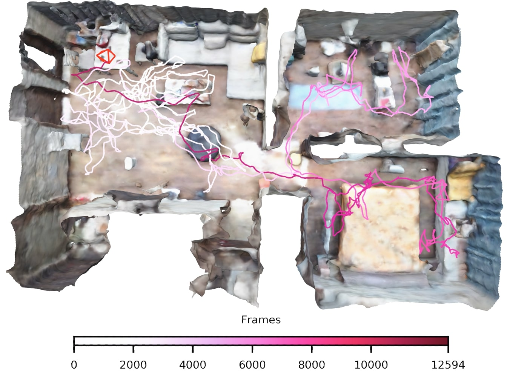

<p align="center">

  <h1 align="center">NICE-SLAM: Neural Implicit Scalable Encoding for SLAM</h1>
  <p align="center">
    <a href="https://zzh2000.github.io"><strong>Zihan Zhu*</strong></a>
    ·
    <a href="https://pengsongyou.github.io"><strong>Songyou Peng*</strong></a>
    ·
    <a href="http://people.inf.ethz.ch/vlarsson/"><strong>Viktor Larsson</strong></a>
    ·
    <a href="http://www.cad.zju.edu.cn/home/weiweixu/weiweixu_en.htm"><strong>Weiwei Xu</strong></a>
    ·
    <a href="http://www.cad.zju.edu.cn/home/bao/"><strong>Hujun Bao</strong></a>
    <br>
    <a href="https://zhpcui.github.io/"><strong>Zhaopeng Cui</strong></a>
    ·
    <a href="http://people.inf.ethz.ch/moswald/"><strong>Martin R. Oswald</strong></a>
    ·
    <a href="https://people.inf.ethz.ch/pomarc/"><strong>Marc Pollefeys</strong></a>
  </p>
  <p align="center"><strong>(* Equal Contribution)</strong></p>
  <h2 align="center">CVPR 2022</h2>
  <h3 align="center"><a href="https://arxiv.org/abs/2112.12130">Paper</a> | <a href="https://pengsongyou.github.io/nice-slam">Project Page</a></h3>
  <div align="center"></div>
</p>
<p align="center">
  <a href="">
    
  </a>
</p>
<br>


### Code Release Date: before April 30, 2022


If you find our code or paper useful, please cite
```bibtex
@inproceedings{Zhu2022CVPR,
  author    = {Zhu, Zihan and Peng, Songyou and Larsson, Viktor and Xu, Weiwei and Bao, Hujun and Cui, Zhaopeng and Oswald, Martin R. and Pollefeys, Marc},
  title     = {NICE-SLAM: Neural Implicit Scalable Encoding for SLAM},
  booktitle = {Proceedings of the IEEE/CVF Conference on Computer Vision and Pattern Recognition (CVPR)},
  year      = {2022}
```
Contact [Zihan Zhu](mailto:zhuzihan2000@gmail.com) and [Songyou Peng](mailto:songyou.pp@gmail.com) for questions, comments and reporting bugs.
